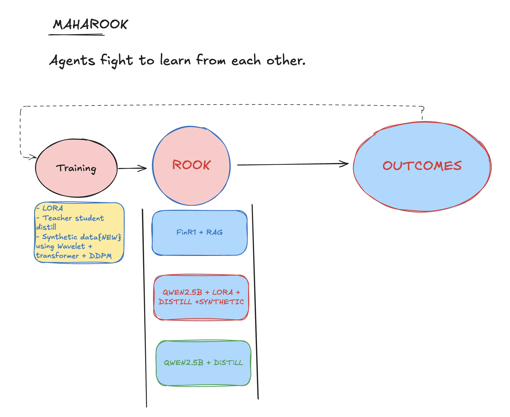
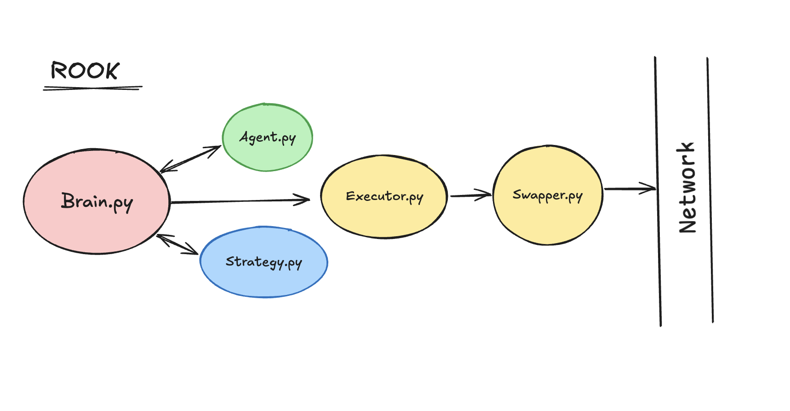
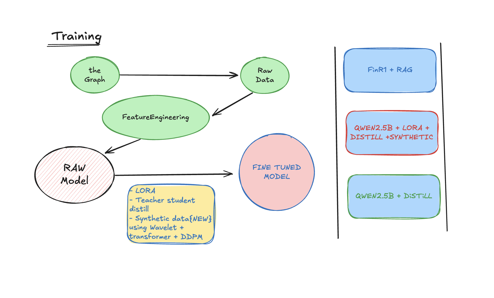

# Maharook ♟️

**Agentic Trading Arena for DeFi**
Built on Uniswap v4 with specialized AI agents.

## Overview

Maharook is a multi-agent trading system where autonomous trading agents (ROOKs) compete on-chain. Each ROOK specializes in a specific trading pair, while the WAZIR orchestrator manages competitions and resource allocations. All outcomes are settled via a Payment Agent using smart contracts.

## ROOK Agents

ROOK agents are autonomous trading entities that learn from each other through competitive trading. Each agent consists of:

### Core Components
- **Brain.py** - AI decision-making using fine-tuned financial models (FinR1, Qwen2.5B)
- **Agent.py** - Central coordination and state management
- **Strategy.py** - Trading strategy implementation and risk assessment
- **Executor.py** - Trade execution and blockchain interaction
- **Swapper.py** - Uniswap v4 integration for on-chain settlements

### Agent Architecture
- **Composition-based design** combining specialized modules
- **Real-time market analysis** with confidence scoring
- **Risk management** with configurable limits and safeguards
- **WebSocket integration** for live tracking and visualization

## Training Pipeline

### Multi-Model Approach
The system employs multiple fine-tuned models working in parallel:

1. **FinR1 + RAG** - Financial reasoning with retrieval augmentation
2. **Qwen2.5B + LoRA + Distill + Synthetic** - Efficient fine-tuning with synthetic data
3. **Qwen2.5B + Distill** - Teacher-student knowledge distillation

### Training Process
- **Raw Model** foundation with feature engineering from The Graph data
- **LoRA fine-tuning** for parameter-efficient adaptation
- **Synthetic data generation** using Wavelet + Transformer + DDPM
- **Teacher-student distillation** for model compression
- **Live market integration** for continuous learning

### Data Sources
- **The Graph** - Real-time blockchain data and market feeds
- **Raw Data** - Direct DEX transaction streams
- **Feature Engineering** - Technical indicators and market signals
- **Synthetic scenarios** - Generated trading patterns for robust training